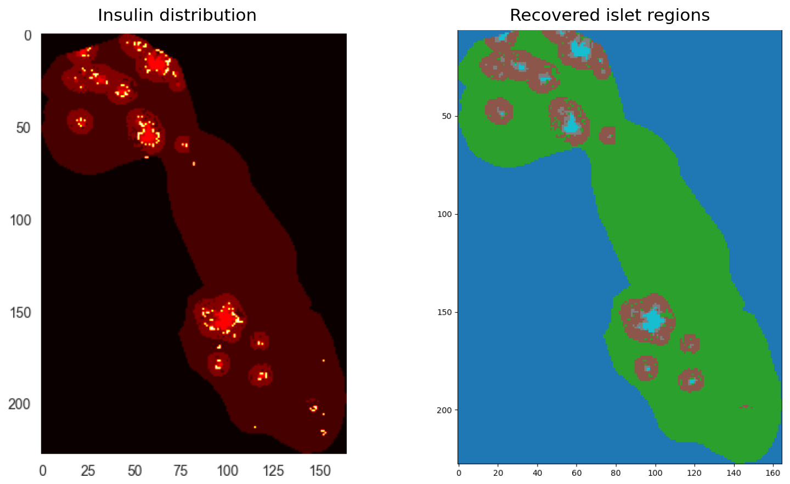

# Peak Learning for Denoising Mass Spectrometry Imaging Data

*Unsupervised and statistical methods for identifying technique-induced "artefact" peaks in ~14,000-channel mass-spectrometry imaging data. [MSc thesis](https://lib.is/lbsn9994214392401471/representation?libis=11:1:1&lang=en), KU Leuven (2023–24).*

## Overview

**Question.** Mass-spectrometry imaging records ~14,000 mass-to-charge channels at each of ~38,000 pixels in a tissue slice, but the technique itself generates spurious peaks that clutter the signal — can they be identified and removed automatically, using one abundant molecule (insulin, in mouse pancreatic tissue) as a test case?

**Method.** Locate the regions where insulin is stored using edge detection and a comparison of three clustering algorithms (K-means, HDBSCAN, fuzzy c-means); flag candidate insulin-related peaks by correlating every channel against insulin and fitting Gaussian mixture models to the correlated channels; test each candidate for spatial enrichment in the insulin regions, and re-run UMAP with the candidates removed.

**Finding (exploratory).** This correlation/GMM method and an independent spatial-distribution method (my co-author's) converge on an overlapping set of candidate peaks, the majority of which pass the spatial-enrichment test; removing them and re-running UMAP suggests the inner/outer boundary of the islets behaves more like a continuum than a sharp split.

**Caveat.** The candidates were *not* checked against a ground-truth database of known molecules, so this repository demonstrates a reproducible method and evaluation process — not a validated biological result.



*Left: insulin concentrates in the islets of Langerhans. Right: the mapping pipeline (edge detection + K-means) recovers those regions — inner islet (cyan), periphery (brown), surrounding tissue (green). This is the firmest result here; the peak identification that follows is exploratory.*

*Final region map (notebook 01): the pipeline recovers the expected concentric islet structure — the firmest result here. The peak identification that follows is exploratory.*

## Repository structure

```
peak_learning/            # analysis package
  core.py                 # MSIData base: data loading, m/z indexing, shared plots
  mapping.py              # IsletMap: edge detection, dilation, clustering (K-means / fuzzy / HDBSCAN)
  peaks.py                # PeakModel: correlation, peak detection, Gaussian mixture models
  validation.py           # spatial-enrichment tests, cross-method comparison, artefact removal, UMAP
  stats.py                # Fisher / z tests, significance thresholds
  viz.py                  # plotting helpers
  io.py, helpers.py       # data loading and small utilities
notebooks/
  01_islet_mapping.ipynb         # builds the islet region map, writes islet_map.npy
  02_peaks_and_validation.ipynb  # correlation + GMM peak identification, then spatial validation + UMAP
figures/                  # exported figures used in this README
```

Peak identification and its validation share the same in-memory object state, so they live in one notebook rather than being split.

## Setup

```bash
conda env create -f environment.yml
conda activate peak-learning
jupyter lab
```

Run the two notebooks in order: `01_islet_mapping.ipynb` writes `data/M2/islet_map.npy` (the region map), which `02_peaks_and_validation.ipynb` loads for the spatial-enrichment tests.

## Data

The MSI dataset (mouse pancreatic tissue, array shape 14,000 × 165 × 228) is not included — it belongs to the lab and is available on request; the notebooks will not run end-to-end without it. It is expected under `data/M2/`. Notebook 01 also writes the derived region map there as `islet_map.npy`, which notebook 02 consumes. For access, open an issue or contact the corresponding lab at KU Leuven.

## Contributions

Two-person MSc thesis (KU Leuven, 2023–24), supervised by Prof. Bart de Moor, with mentors Melanie Nijs and Thomas Vanhemel.

Work in this repository that I (Serkan Shentyurk) wrote:

- **Islet mapping** — edge detection + clustering (thesis Ch 3)
- **Peak identification** — correlation analysis + Gaussian mixture models (Ch 4)
- **Validation** — spatial-enrichment testing, cross-method comparison, and UMAP analysis (Ch 6; the chapter *write-up* was co-authored, the code here is mine)

The **sliding-window method** (Ch 5) was developed by my co-author and is not included in this repository.

## Thesis

Butcher, C., & Shentyurk, S. (2024). *Peak Learning for Denoising Mass Spectrometry Imaging Data* [Master's thesis, KU Leuven, Faculty of Science]. Supervisor: Prof. Bart de Moor; mentors: Melanie Nijs, Thomas Vanhemel. https://lib.is/lbsn9994214392401471/representation?libis=11:1:1&lang=en

## Licence

MIT — see [LICENSE](LICENSE).
